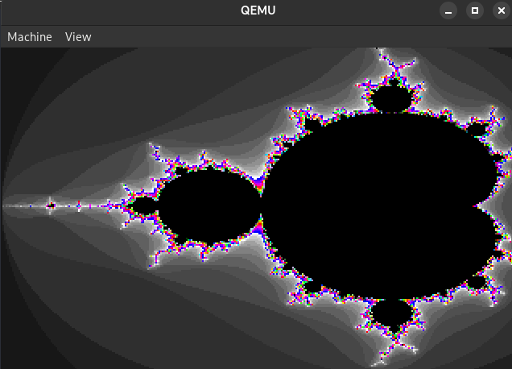

# List 5

- [List 5](#list-5)
- [Learn](#learn)
- [Exercises](#exercises)
  - [Exercise 1](#exercise-1)
  - [Exercise 2](#exercise-2)
  - [Exercise 3](#exercise-3)
  - [Exercise 4](#exercise-4)
  - [Exercise 5](#exercise-5)

# Learn

Załączam folder [learn](./learn) z plikami, które pomogły mi zrozumieć jak działa asembler x86 i w konsekwnecji rozwiązać listę zadań.

# Exercises

## Exercise 1

(5pt) Napisz program w asemblerze NASM (lub innym) dla procesora x86, który:

- Pobiera liczbę całkowitą w postaci tekstowej z wejścia standardowego (np. "12345")
- Oblicza sumę cyfr tej liczby (w przykładzie: 1 + 2 + 3 + 4 + 5 = 15)
- Wyświetla wynik na standardowym wyjściu

Do wczytywania i wyświetlania użyj wywołań systemowych read i write.

Rozwiązanie jest dostępne pod [ex1.asm](./ex1/ex1.asm). Jest ono połączeniem kodu dostępnego pod adresem https://asmtutor.com/ z napisaną przeze mnie funkcją liczącą sumę cyfr. Program rozwiązuje przykładową liczbę `12345`:

```bash
[ex1] ./ex1
Enter a number: 12345
15
```

Owa funkcja:

```asm
; ---
; int sum_of_digits, eax = integer
; Sum of digits function
sum_of_digits:
    push ebx
    push ecx
    push edx
    push esi
    mov  esi, eax
    mov  edi, 0

.sumLoop:
    mov eax, esi
    mov edx, 0
    mov ecx, 10
    div ecx
    add edi, edx
    mov esi, eax
    cmp esi, 0
    jnz .sumLoop

.restore:
    mov eax, edi
    pop esi
    pop edx
    pop ecx
    pop ebx
    ret  
```

Wykorzystanie `read` oraz `write` widać w poniższych funkcjach (nie używam printf):

```asm
; print the message
mov edx, msglen
mov ecx, msg
mov ebx, 1
mov eax, 4
int 80h

; read the input
mov edx, bufferlen
mov ecx, buffer
mov ebx, 0
mov eax, 3
int 80h
```

Dodatkowo sporządziłem niezwykle przydatny i uniwersalnie wykorzystywany w kolejnych zadaniach `Makefile` dla zbioru plików asm.

```Makefile
CC = nasm
CFLAGS = -f elf32
LD = ld
LDFLAGS = -m elf_i386
SRC = $(wildcard *.asm)
OBJ = $(SRC:.asm=.o)
BIN = $(SRC:.asm=)

.PHONY: all clean

all: $(BIN)

%.o: %.asm
	$(CC) $(CFLAGS) -o $@ $<

%: %.o
	$(LD) $(LDFLAGS) -o $@ $<
	rm -f $<

clean:
	rm -f $(OBJ) $(BIN)
```

## Exercise 2

(5pt) Napisz program w asemblerze NASM (lub innym) dla procesora x86, który:

Przyjmuje jako dane wejściowe macierz 3x3 (9 liczb całkowitych, zapisanych w pamięci programu).
Wylicza sumę wszystkich elementów macierzy oraz sumę elementów na przekątnej głównej.
Wyświetla oba wyniki na standardowym wyjściu

    Suma elementów: X
    Suma przekątnej: Y

Użyj wywołań systemowych do wyświetlania wyników. Wyjaśnij w gdb, jak program przechowuje macierz w pamięci i jak przetwarza jej elementy. 

Rozwiązanie dostępne pod [ex2](./ex2/ex2.asm). Wykorzystałem wiele plików aby poćwiczyć ich łączenie w jedną binarkę. Dzięki temu dobrze również widać podział na kod, który liczy oraz kod, który dokonuję interakcji z użytkownikiem.

Macierz zdefiniowałem następująco:

```asm
matrix db 0,0,0\
        ,0,0,0\
        ,0,0,0 ; 3x3 matrix
```

Czyli potraktowałem ją jako tablicę jednowymiarową, sztucznie ustalając gdzie znajduje się podział na kolumny i rzędy.
Istotnie pomocny dla prezentacji przetwarzania danych przez program jest plik `.gdbinit`, w którym zawarłem automatycznie uruchamianie layoutu dla rejestrów oraz widoku bieżących instrukcji assemblera. 

```plaintext
layout asm
layout regs
focus cmd
set debuginfod enabled on
```

Wykonajmy:

```bash
gdb ./ex2
(gdb) b sumAll # pokazanie sumy wszystkich
(gdb) b sumDiagonal # pokazanie sumy na przekątnej
(gdb) r
(gdb) si
```

## Exercise 3

(10pt) Napisz program w asemblerze NASM (lub innym) dla procesora x86, który wyświetla na standardowym wyjściu liczbę 32-bitową w kodzie szesnastkowym, czyli np. takie printf("%x\n",123456). Do wyświetlania wykorzystaj wywołanie systemowe write. Pokaż jak program wykonuje się w gdb (debugger).

Rozwiązanie dostępne pod [ex3](./ex3/ex3.asm). Program wykorzystuje wywołanie systemowe `write` do wyświetlenia liczby w formacie szesnastkowym. Odpowiada pełną długością liczby, czyli w przypadku liczby `1024` wyświetli `0x00000400`.

```bash
[ex3] ./ex3
Enter an integer: 1024
0x00000400
```

Sam kod w sekcji konwertującej opatrzyłem komentarzami, które wyjaśniają co się stało. 

## Exercise 4

(10pt) Napisz program w asemblerze x86 (32-bit), który wysyła na standardowe wyjście liczby pierwsze z zakresu od 1 do 100 000. 

Roziązanie dostępne pod [ex4](./ex4/ex4.asm). Program wykorzystuje algorytm sito Eratostenesa do wyznaczenia liczb pierwszych w zakresie od 1 do 100 000. 

## Exercise 5

(10pt) Napisz w asemblerze x86 program rysujący zbiór Mandelbrota (patrz wykład 2024.12.02). Inicjalizację trybu graficznego można przeprowadzić wykorzystując kod boot (przy oddawaniu należy umieć wytłumaczyć kod boot.asm). 

Rozwiązanie dostępne pod [ex5](./ex5/boot.asm). Program rysuje zbiór Mandelbrota w trybie graficznym dla x86 (320x200 mode 13h).



**Nie wykorzystałem kodu boot.asm**, ponieważ nie był potrzebny. Skorzystałem jedynie z części która uruchamia tryb graficzny.

```asm
mov ax, 0x2401
int 0x15
mov ax, 0x13
int 0x10
```

Wykorzystałem pierwszy algorytm z https://en.wikipedia.org/wiki/Plotting_algorithms_for_the_Mandelbrot_set. 
Próbowałem wykonać wersję zoptymalizowaną, ale nie udało mi się zaimplementować jej w całości, dlatego prezentuję ten podstawowy algorytm.

Kod jest wyjaśniony w komentarzach.
