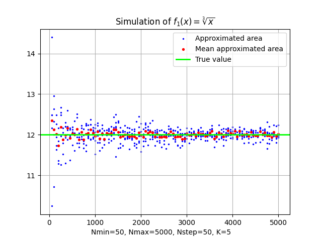
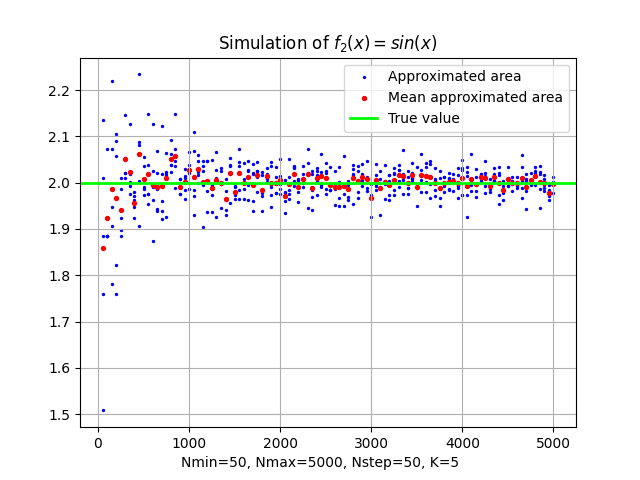
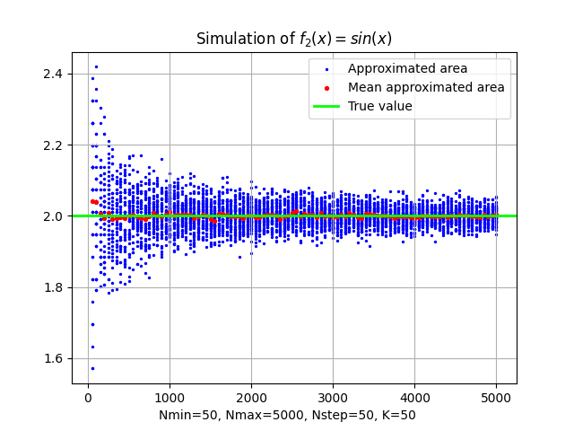
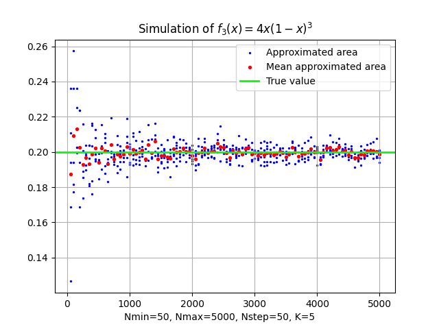
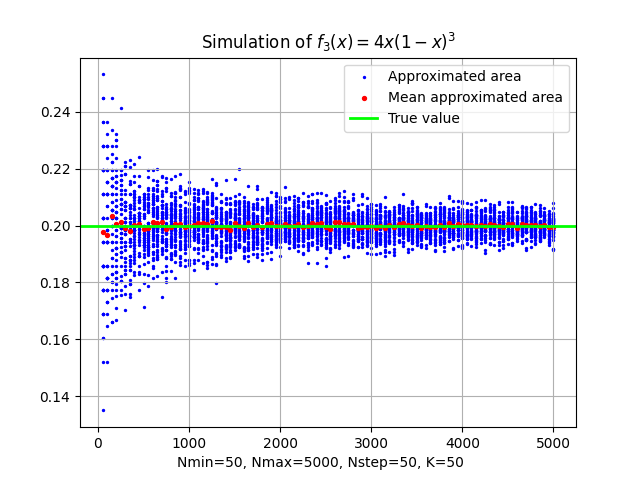
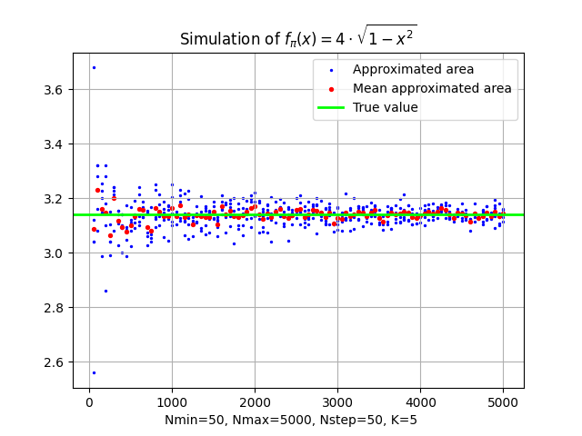
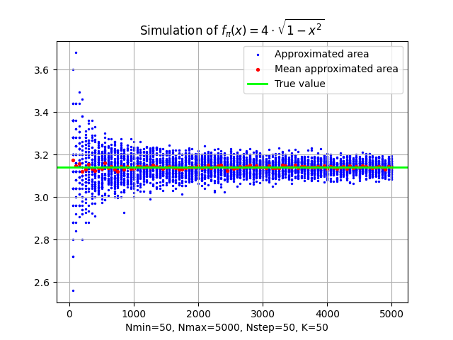

# Metody Probabilistyczne i Statystyka
## ZADANIE DOMOWE 1
### Rafał Włodarczyk, 2024-11-05

## Implementacja Symulacji

Kod symulacji dostępny jest w pliku `main.py`, złożonym wraz z tym dokumentem.

Zadaną symulację zaimplementowałem w języku `python`. Do wykonania obliczeń oraz wyświetlenia wyników wykorzystałem biblioteki
*[numpy](https://numpy.org/doc/stable/)* oraz *[matplotlib](https://matplotlib.org/stable/contents.html)*.
Moje środowisko w systemie linux można odtworzyć przy użyciu następujących poleceń (zakładam zainstalowanego pythona w wersji 3.12):

```bash
$ python -m venv venv # tworzę virtual environment
$ source venv/bin/activate # aktywuję virtual environment
(venv) $ pip install numpy matplotlib # instaluję biblioteki, których używam do napisania symulacji
```

## Obliczenia oraz wykresy

Dla każdej z zadanych funkcji wykonałem symulację dla $k=5$ oraz $k=50$. Dla każdej z nich wygenerowałem wykresy, na których zaznaczyłem wartość średnią danej próbki oraz wartość oczekiwaną - zgodnie z wyliczeniami zamieszczonymi przy odpowiednich wykresach.

### Obliczenia oraz wykresy dla funkcji $f_1(x)=\sqrt[3]{x}$

Policzmy zadaną całkę:

$$
\int_{0}^{8} \sqrt[3]{x}\, dx = \left[\frac{3}{4}x^{\frac{4}{3}} \right]_{0}^{8} = \frac{3}{4} \cdot \left(8^{\frac{4}{3}} - 0^{\frac{4}{3}}\right) = 12
$$

Wykresy wygenerowane dla funkcji $f_1(x)=\sqrt[3]{x}$ w `main.py`:

<div style="display: flex; justify-content: space-between;">
  
  
</div>

### Obliczenia oraz wykresy dla funkcji $f_2(x)=\sin(x)$

Policzmy zadaną całkę:

$$
\int_{0}^{\pi} \sin(x) dx = \left[- \cos(x) \right]_{0}^{\pi} = - (\cos(\pi) - \cos(0)) = - (-1 - 1) = 2
$$

<div style="display: flex; justify-content: space-between;">
  
  
</div>

### Obliczenia oraz wykresy dla funkcji $f_3(x)=4x(1-x)^3$

$$
\int_{0}^{1} 4x(1-x)^3 = \int_{0}^{1} 4x(1-x)(1^2+x+x^2) = ... = \frac{1}{5}
$$

<div style="display: flex; justify-content: space-between;">
  
  
</div>

## Wyznaczenie wartości liczby $\pi$

Do wyznaczenia wartości liczby $\pi$ posłużyłem się funkcją opisującą okrąg jednostkowy. Wyznaczyłem wartość liczby $\pi$ dla $k=5$ oraz $k=50$.

Zauważmy, że 

$$
\int_{0}^{1} 4\sqrt{1-x^2} dx = 4 \cdot \int_{0}^{1} \sqrt{1-x^2} dx = ... = \pi
$$

Całkując od $0$ do $1$ funkcję $f_{pi}(x)=4\sqrt{1-x^2}$ otrzymujemy $\pi$.

### Obliczenia oraz wykresy dla funkcji $f_{pi}(x)=4\sqrt{1-x^2}$

- $f_{pi}=4\sqrt{1-x^2}$

<div style="display: flex; justify-content: space-between;">
  
  
</div>

## Wnioski