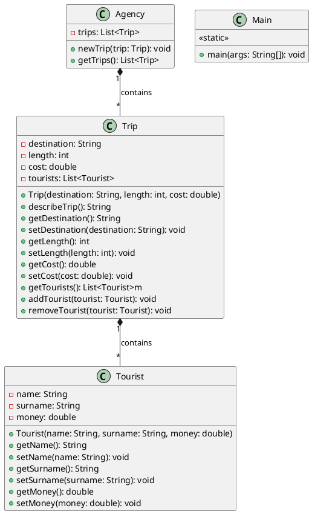

> [!WARNING]  
> God forgive me, for I, in late 2024 AD, wrote a few lines of insta-legacy Java.<br/>
> This repository was created for java labs at my university and is not and will not be an actual project.


## 1 - VSCode

XD

## 2 - Maven

Phases:
- validate
- compile
- test
- package
- install
- deploy

Maven setup log:

```bash
mvn archetype:generate -DgroupId=org.rafisto -DartifactId=tourism-agency -DarchetypeArtifactId=maven-archetype-quickstart -DinteractiveMode=false
```


```bash
mvn clean install
mvn build
mvn exec:java
```

## 3 - `git`

[Merge](https://github.com/Rafisto/macyna-lab-1/commit/19e86339101e8e683e0d9acd00f8255215efe99a)

from two branches:

[branch1 (michal)](https://github.com/Rafisto/macyna-lab-1/commit/eceb94c545769552c59e84e1e2b10bd986f401d1)
[branch2 (rafal)](https://github.com/Rafisto/macyna-lab-1/commit/dfadb057c46d7e83946b3c51963cf3dc2d477abb)

## 4 - PMD

```bash
# using this pmd ruleset
# https://github.com/pmd/pmd/blob/master/pmd-java/src/main/resources/rulesets/java/quickstart.xml
mvn pmd:pmd
mvn pmd:check
```

PMD is clearly working as it pointed out a few errors in the code, such as:

```xml
<violation beginline="6" endline="6" begincolumn="13" endcolumn="28" rule="LooseCoupling" ruleset="Best Practices" package="org.rafisto" class="Agency" externalInfoUrl="https://docs.pmd-code.org/pmd-doc-7.3.0/pmd_rules_java_bestpractices.html#loosecoupling" priority="3">
Avoid using implementation types like 'ArrayList'; use the interface instead
</violation>
```

## 5 - Checkstyle

```bash
# using this checkstyle ruleset
# https://github.com/checkstyle/checkstyle/blob/master/src/main/resources/google_checks.xml
mvn checkstyle:check
```

Checkstyle is unfortunately also working:

```bash
[WARN] /home/rafisto/Documents/macyna-lab-1/src/main/java/org/rafisto/Agency.java:7: 'member def modifier' has incorrect indentation level 4, expected level should be 2. [Indentation]
```

Modify ruleset to:

```xml
<module name="Indentation">
    <property name="basicOffset" value="4" />
    <property name="braceAdjustment" value="4" />
    <property name="caseIndent" value="4" />
    <property name="throwsIndent" value="4" />
    <property name="lineWrappingIndentation" value="4" />
    <property name="arrayInitIndent" value="4" />
</module>
```

## 6 - PlantUML

```bash
yay -S plantuml
plantuml ./diagram.puml # output to png
```



## 7 - As in the repository

```bash
[src] ls -lahis
total 16K
17219700 4.0K drwxr-xr-x 4 rafisto rafisto 4.0K Oct 16 16:33 .
17218935 4.0K drwxr-xr-x 5 rafisto rafisto 4.0K Oct 16 17:31 ..
17219701 4.0K drwxr-xr-x 3 rafisto rafisto 4.0K Oct 16 16:33 main
17219706 4.0K drwxr-xr-x 3 rafisto rafisto 4.0K Oct 16 16:33 test
```
