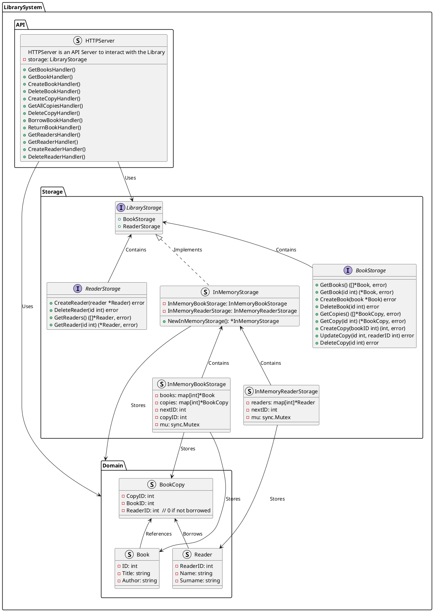
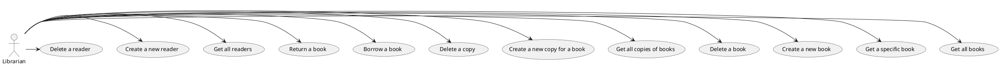

# Library System

A simple library management system that allows managing books, readers, and book copies.





## Features

- **Book Management**: Add, delete, and view books in the library.
- **Book Copies**: Manage copies of each book, track borrowed copies, and handle borrow/return functionality.
- **Reader Management**: Add and delete readers who can borrow books.
- **API**: Expose RESTful endpoints for interacting with the system, including operations on books, copies, and readers.

### Unit Tests

```bash
go test -coverprofile=coverage.out ./... && go tool cover -html=coverage.out -o coverage.html
```

### Linting

```bash
golangci-lint run
```

### UML

Run `plantuml` to generate the *.png* output:

```bash
plantuml diagram.puml
plantuml usage.puml
```

## Components

### Domain

- **Book**: Represents a book in the library.
- **BookCopy**: Represents a copy of a book, which may be borrowed by a reader.
- **Reader**: Represents a reader who can borrow books.

### Storage

- **BookStorage**: Interface for managing book data.
- **ReaderStorage**: Interface for managing reader data.
- **LibraryStorage**: Combines both `BookStorage` and `ReaderStorage`.
- **InMemoryStorage**: In-memory implementation of `LibraryStorage` with book and reader management.
  
### API

- **HTTPServer**: API server to handle HTTP requests, providing endpoints for interacting with books, copies, and readers.

## Endpoints

See swagger documentation at `http://localhost:8080/docs/index.html`, or view it [here](./docs/swagger.yaml)

- `GET /books`: Get all books
- `GET /books/{id}`: Get a specific book
- `POST /books`: Create a new book
- `DELETE /books/{id}`: Delete a book
- `GET /copies`: Get all copies of books
- `POST /copies`: Create a new copy for a book
- `DELETE /copies/{id}`: Delete a copy
- `POST /borrow`: Borrow a book
- `POST /return`: Return a book
- `GET /readers`: Get all readers
- `POST /readers`: Create a new reader
- `DELETE /readers/{id}`: Delete a reader

## Storage

This system uses an in-memory storage implementation, which is simple and efficient for development and testing. Data is stored in memory with no persistence across sessions.

It can easily be replaced with a persistent storage implementation (e.g., using a database) by implementing the `BookStorage` and `ReaderStorage` interfaces.

## Usage

- Clone the repository and run the API server.
- Use any API client (e.g., Postman) or HTTP requests to interact with the system.
- Example data is populated in main.go for testing purposes.
- You can manage books, copies, and readers via the provided API.

## Use Cases

1. Get all books

- Librarian requests all books
- System returns all books, including their ID, Title and Author
- (Alternative) System returns empty list if no books exist

2. Get a specific book

- Librarian requests a specific book by ID
- System returns the book with the given ID, including its Title and Author
- (Alternative) System returns an error if the book does not exist

3. Create a new book

- Librarian creates a new book providing:
  - Title
  - Author
- System creates the book and returns its ID and successful message
- (Alternative) System returns an error if the request is invalid (missing data)

4. Delete a book

- Librarian deletes a book by ID
- System deletes the book with the given ID
- (Alternative) System returns an error if the book does not exist.

5. Get all copies of books

- Librarian requests all copies of books
- System returns all copies, including their ID, Book details and availability
- (Alternative) System returns empty list if no copies exist

6. Create a new copy for a book

- Librarian creates a new copy for a book providing:
  - Book ID
- System creates the copy and returns its ID, Book ID, and Reader ID (which is set to 0, meaning it is not borrowed)
- (Alternative) System returns an error if the book does not exist

7. Delete a copy

- Librarian deletes a copy by ID
- System deletes the copy with the given ID
- (Alternative) System returns an error if the copy does not exist.

8. Borrow a book

- Librarian borrows for a Reader **the first available copy of a requested book** by providing:
  - Book ID
  - Reader ID
- System updates the copy to set the Reader ID and returns the id of the copy
- (Alternative) System returns an error if the reader does not exist
- (Alternative) System returns an error if the book does not exist
- (Alternative) System returns an error if no copies are available
- (Alternative) System returns an error if the copy is already borrowed
- (Alternative) System returns an error if the reader has already borrowed a copy

9.  Return a book

- Librarian returns a copy for a Reader by providing:
  - Copy ID
  - Reader ID
- System updates the copy to set the Reader ID to 0 (not borrowed) and returns the updated copy
- (Alternative) System returns an error if the reader does not exist
- (Alternative) System returns an error if the copy does not exist
- (Alternative) System returns an error if the copy is not borrowed by the reader
- (Alternative) System returns an error if the copy is already returned

10.  Get all readers

- Librarian requests all readers
- System returns all readers, including their ID, Name and Surname
- (Alternative) System returns empty list if no readers exist

11.  Create a new reader

- Librarian creates a new reader providing:
  - Name
  - Surname
- System creates the reader and returns its ID, Name, and Surname
- (Alternative) System returns an error if the request is invalid (missing data)- 

12.  Delete a reader

- Librarian deletes a reader by ID
- System deletes the reader with the given ID
- (Alternative) System returns an error if the reader does not exist.

## Java Equivalents

- Class - Struct
- Class Diagram - Struct Diagram (above) at [code-uml](./diagram.png)
- Sequence Diagram - Usage Diagram (above) at [usage-uml](./usage.png)
- Domain - Model
- PMD, Checkstyle - go vet, golangci-lint (.golangci.yml)
- Unit tests - go test -v (-cover) testify
- Maven - go mod
- DB - LibraryStorage (interface) + InMemoryStorage (implementation)