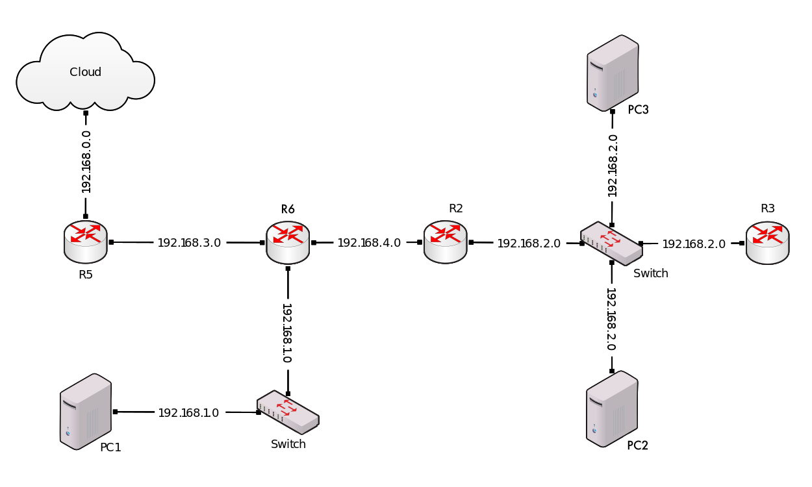

## GNS-Equivalent

- [GNS-Equivalent](#gns-equivalent)
- [Description](#description)
- [Base Image](#base-image)
- [Setup](#setup)
  - [Computers](#computers)
  - [Switches](#switches)
  - [Routers](#routers)
- [Tasks](#tasks)
  - [Task 1](#task-1)
    - [Task 1.1](#task-11)
    - [Task 1.2](#task-12)
    - [Task 1.3](#task-13)
    - [Task 1.4](#task-14)
    - [Task 1.5](#task-15)
  - [Task 2](#task-2)
  - [Task 3](#task-3)
    - [tcpdump on `router2`](#tcpdump-on-router2)
    - [tcpdump on `router6`](#tcpdump-on-router6)
    - [tcpdump on `router5`](#tcpdump-on-router5)

## Description

I've decided to create a network simulation using docker instead of GNS3. The goal is to simulate the following network topology:



## Base Image

A huge improvement is the fact that I can use the same base image for all the network devices, and setting their role at runtime. This is possible because the base image is a full Debian system with packages installed.

```dockerfile
FROM debian:bookworm

RUN apt-get update && apt-get install -y iproute2 inetutils-ping iptables traceroute tcpdump curl

CMD sleep infinity
```

The `CMD` part will be overriden by a device-specific entrypoint script, such as [router2.sh](./router2.sh)

## Setup

The whole setup is created via [docker-compose manifest](./compose.yaml) and follows a similar pattern for all devices, the main difference being statically assigned IP addresses and the entrypoint script.

### Computers

PC1 has been assigned:
- Inteface `eth0` with IP `192.168.1.100`
- Default gateway set to `192.168.1.10`

PC2 has been assigned:
- Interface `eth0` with IP `192.168.2.100`
- Default gateway set to `192.168.2.10`
  
PC3 has been assigned:
- Interface `eth0` with IP `192.168.2.101`
- Default gateway set to `192.168.2.10`

### Switches

Docker provides a bridge network (virtual switch) for each container. I have created a custom bridge network for each subnet,
ensuring only `net5` has access to the internet. The other networks are isolated, and must route through `net5` to reach the internet.

For example, in order to reach google.com from `pc3` it must first route through `router2`, `router6` and `router5` to eventually reach the internet.
We can see this simply by running traceroute from `pc3` to `google.com`:

```bash
docker exec -it pc3 traceroute google.com
traceroute to google.com (142.250.186.206), 30 hops max, 60 byte packets
 1  192.168.2.10 (192.168.2.10)  0.299 ms  0.278 ms  0.272 ms # router 2 (def gw in local network)
 2  192.168.4.10 (192.168.4.10)  0.264 ms  0.240 ms  0.228 ms # router 6 (net4)
 3  192.168.3.11 (192.168.3.11)  0.218 ms  0.200 ms  0.188 ms # router 5 (net3)
 4  192.168.5.1 (192.168.5.1)  0.178 ms  0.156 ms  0.143 ms   # gateway (net5)
 5  ... we exited the local topology and are now in the internet ...
```

Therefore all switches are virtual and are host running on host machine:

Example of an internal bridge

```yaml
net4:
driver: bridge
internal: true
ipam:
    config:
    - subnet: 192.168.4.0/24
```

Example of an external bridge

```yaml
net5:
driver: bridge
ipam:
    config:
    - subnet: 192.168.5.0/24
```

```bash
ip a
...
430: br-71ef71cec732: <BROADCAST,MULTICAST,UP,LOWER_UP> mtu 1500 qdisc noqueue state UP group default 
    inet 192.168.1.1/24 brd 192.168.1.255 scope global br-71ef71cec732
431: br-bfd3ace320a0: <BROADCAST,MULTICAST,UP,LOWER_UP> mtu 1500 qdisc noqueue state UP group default 
    inet 192.168.3.1/24 brd 192.168.3.255 scope global br-bfd3ace320a0
432: br-90c6f41e0785: <BROADCAST,MULTICAST,UP,LOWER_UP> mtu 1500 qdisc noqueue state UP group default 
    inet 192.168.5.1/24 brd 192.168.5.255 scope global br-90c6f41e0785
433: br-cc07077d9337: <BROADCAST,MULTICAST,UP,LOWER_UP> mtu 1500 qdisc noqueue state UP group default 
    inet 192.168.2.1/24 brd 192.168.2.255 scope global br-cc07077d9337
434: br-c5fccc0c5e99: <BROADCAST,MULTICAST,UP,LOWER_UP> mtu 1500 qdisc noqueue state UP group default 
    inet 192.168.4.1/24 brd 192.168.4.255 scope global br-c5fccc0c5e99
```

### Routers

The routers are configured to route between the different networks. They are assigned IP addresses on different interfaces, and are configured to route between them. 

Router2 has been assigned:
- Interface `eth0` with IP `192.168.4.11` (net4)
- Interface `eth1` with IP `192.168.2.10` (net2)
- Default gateway set to `192.168.4.10`

Router3 has been assigned:
- Interface `eth0` with IP `192.168.2.11` (net2)
- Default gateway set to `192.168.2.10`

Router6 has been assigned:
- Interface `eth0` with IP `192.168.1.10` (net1)
- Interface `eth1` with IP `192.168.3.10` (net3)
- Interface `eth2` with IP `192.168.4.10` (net4)
- Default gateway set to `192.168.3.11`

Router5 (internet gateway) has been assigned:
- Interface `eth0` with IP `192.168.3.11` (net3)
- Interface `eth1` with Dynamic IP (net5)
- Default gateway set to `192.168.5.1` (this is the docker gateway)

## Tasks

### Task 1

#### Task 1.1

The virtual network has been connected to the physical network using a docker bridge (net5). We can see that the router5 can easily query different websites, such as github.com, google.com, etc. 

```bash
docker exec -it router5 curl -I https://github.com | head -n 3
HTTP/2 200 
date: Wed, 07 May 2025 07:05:23 GMT
content-type: text/html; charset=utf-8
```

#### Task 1.2

The address for router5 is not specified in the `compose.yaml`, therefore it will be assigned a dynamic IP address. We can see this by running the following command:

```bash
docker exec -it router5 ip a

3: eth1@if512: <BROADCAST,MULTICAST,UP,LOWER_UP> mtu 1500 qdisc noqueue state UP group default 
    link/ether 42:3c:d2:67:55:58 brd ff:ff:ff:ff:ff:ff link-netnsid 0
    inet 192.168.5.2/24 brd 192.168.5.255 scope global eth1
       valid_lft forever preferred_lft forever
```

As we can see `eth1` on `router5` has been assigned the dynamic IP address `192.168.5.2` (first available IP address in the subnet).

#### Task 1.3

All other devices have statically assigned IP addresses.

#### Task 1.4

All devices can ping each other, and the routers can route between the different networks. For example, we can ping `pc1` from `pc3`:

```bash
docker exec -it pc3 ping -c 4 192.168.1.100
PING 192.168.1.100 (192.168.1.100): 56 data bytes
64 bytes from 192.168.1.100: icmp_seq=0 ttl=62 time=0.105 ms
64 bytes from 192.168.1.100: icmp_seq=1 ttl=62 time=0.146 ms
```

#### Task 1.5

All devices can ping the internet, and the routers can route between the different networks. For example, we can ping `google.com` from `router3`:

```bash
docker exec -it router3 ping -c 4 google.com
PING google.com (142.250.75.14): 56 data bytes
64 bytes from 142.250.75.14: icmp_seq=0 ttl=113 time=24.736 ms
64 bytes from 142.250.75.14: icmp_seq=1 ttl=113 time=24.854 ms
```

### Task 2

We can simply run `tcpdump` on all 3 routers to see the traffic going through them. Let's setup `tcpdump` on:
- Router5 (to monitor `192.168.5.0/24`)
- Router6 (to monitor `192.168.3.0/24`)
- Router2 (to monitor `192.168.2.0/24`)

```bash
docker exec -it router5 tcpdump -i eth1 -n -e -s 0
docker exec -it router6 tcpdump -i eth0 -n -e -s 0
docker exec -it router2 tcpdump -i eth0 -n -e -s 0
```

Example output showing that `tcpdump` is running:

```bash
tcpdump: verbose output suppressed, use -v[v]... for full protocol decode
listening on eth1, link-type EN10MB (Ethernet), snapshot length 262144 bytes
```

### Task 3

Let's run `ping -c 1 google.com` from `pc3`, with aforementioned monitoring enabled.

```bash
docker exec -it pc3 ping -c 1 google.com
PING google.com (142.250.203.206): 56 data bytes
64 bytes from 142.250.203.206: icmp_seq=0 ttl=114 time=25.165 ms
--- google.com ping statistics ---
1 packets transmitted, 1 packets received, 0% packet loss
round-trip min/avg/max/stddev = 25.165/25.165/25.165/0.000 ms
```

Let's now examine the outputs of the 3 `tcpdump` commands we started earlier.

#### tcpdump on `router2`

```bash
docker exec -it router2 tcpdump -i eth0 -n -e -s 0
tcpdump: verbose output suppressed, use -v[v]... for full protocol decode
listening on eth0, link-type EN10MB (Ethernet), snapshot length 262144 bytes
07:37:21.114322 0e:b7:a7:77:c5:f0 > 56:54:82:7b:06:ca, ethertype IPv4 (0x0800), length 70: 192.168.2.101.48075 > 1.1.1.1.53: 29720+ A? google.com. (28)
07:37:21.121522 56:54:82:7b:06:ca > 0e:b7:a7:77:c5:f0, ethertype IPv4 (0x0800), length 86: 1.1.1.1.53 > 192.168.2.101.48075: 29720 1/0/0 A 142.250.203.142 (44)
07:37:21.121994 0e:b7:a7:77:c5:f0 > 56:54:82:7b:06:ca, ethertype IPv4 (0x0800), length 98: 192.168.2.101 > 142.250.203.142: ICMP echo request, id 9, seq 0, length 64
07:37:21.151346 56:54:82:7b:06:ca > 0e:b7:a7:77:c5:f0, ethertype IPv4 (0x0800), length 98: 142.250.203.142 > 192.168.2.101: ICMP echo reply, id 9, seq 0, length 64
```

#### tcpdump on `router6`

```bash
docker exec -it router6 tcpdump -i eth1 -n -e -s 0
tcpdump: verbose output suppressed, use -v[v]... for full protocol decode
listening on eth1, link-type EN10MB (Ethernet), snapshot length 262144 bytes
07:37:21.114362 2e:da:ec:9c:91:f9 > 6e:14:78:cc:75:3d, ethertype IPv4 (0x0800), length 70: 192.168.4.11.48075 > 1.1.1.1.53: 29720+ A? google.com. (28)
07:37:21.121507 6e:14:78:cc:75:3d > 2e:da:ec:9c:91:f9, ethertype IPv4 (0x0800), length 86: 1.1.1.1.53 > 192.168.4.11.48075: 29720 1/0/0 A 142.250.203.142 (44)
07:37:21.122021 2e:da:ec:9c:91:f9 > 6e:14:78:cc:75:3d, ethertype IPv4 (0x0800), length 98: 192.168.4.11 > 142.250.203.142: ICMP echo request, id 9, seq 0, length 64
07:37:21.151327 6e:14:78:cc:75:3d > 2e:da:ec:9c:91:f9, ethertype IPv4 (0x0800), length 98: 142.250.203.142 > 192.168.4.11: ICMP echo reply, id 9, seq 0, length 64
```

#### tcpdump on `router5`

```bash
docker exec -it router5 tcpdump -i eth1 -n -e -s 0
tcpdump: verbose output suppressed, use -v[v]... for full protocol decode
listening on eth1, link-type EN10MB (Ethernet), snapshot length 262144 bytes
07:37:21.114382 de:05:78:68:bd:76 > e2:0b:c8:70:a9:b4, ethertype IPv4 (0x0800), length 70: 192.168.5.2.48075 > 1.1.1.1.53: 29720+ A? google.com. (28)
07:37:21.121495 e2:0b:c8:70:a9:b4 > de:05:78:68:bd:76, ethertype IPv4 (0x0800), length 86: 1.1.1.1.53 > 192.168.5.2.48075: 29720 1/0/0 A 142.250.203.142 (44)
07:37:21.122030 de:05:78:68:bd:76 > e2:0b:c8:70:a9:b4, ethertype IPv4 (0x0800), length 98: 192.168.5.2 > 142.250.203.142: ICMP echo request, id 9, seq 0, length 64
07:37:21.151312 e2:0b:c8:70:a9:b4 > de:05:78:68:bd:76, ethertype IPv4 (0x0800), length 98: 142.250.203.142 > 192.168.5.2: ICMP echo reply, id 9, seq 0, length 64
```

As we can clearly see, the masquarade routing is working and the packets are being in the correct order, which can be seen by the timestamps.
