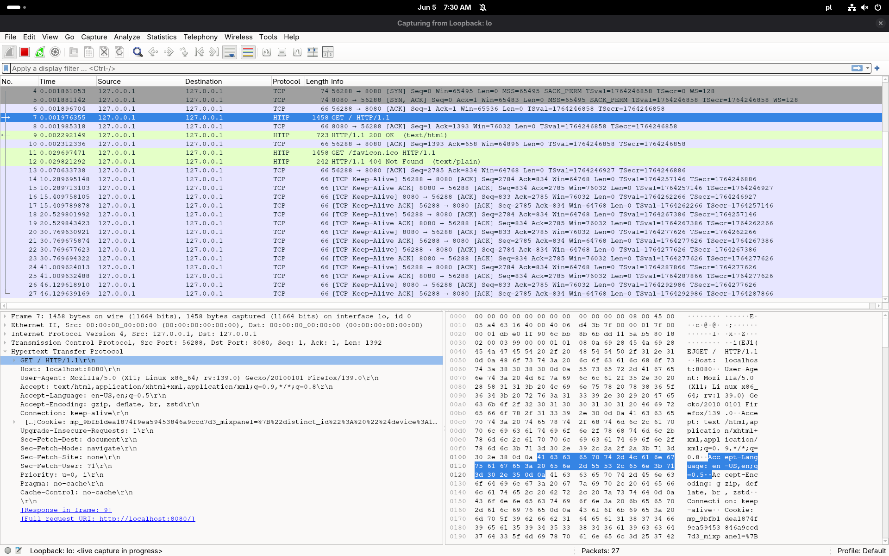
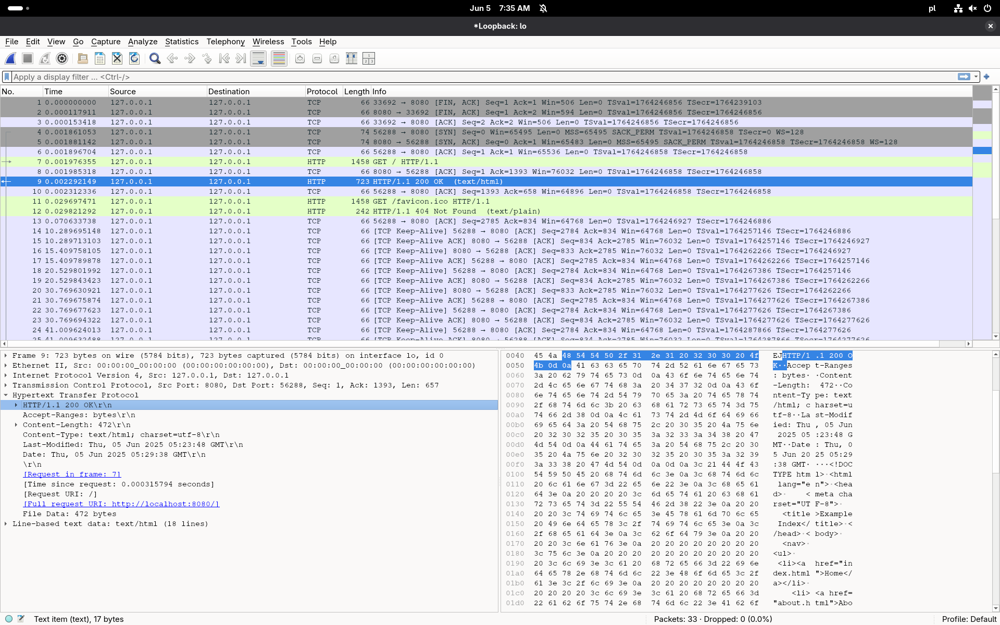

## HTTP

- [HTTP](#http)
- [Running `server3.pl`](#running-server3pl)
  - [Installng Perl Dependencies](#installng-perl-dependencies)
  - [Running the Server](#running-the-server)
- [Analyzing `server3.pl`](#analyzing-server3pl)
- [Header responder](#header-responder)
- [WWW server](#www-server)
- [Packet Analysis](#packet-analysis)
- [An interesting fact](#an-interesting-fact)

## Running `server3.pl` 

### Installng Perl Dependencies

This is a perl script therefore we must install the required dependencies

```bash
cpan HTTP::Daemon HTTP::Status IO::File
```

### Running the Server

```bash
perl server.pl
[http] perl server.pl
Please contact me at: <URL:http://[fe80::90fa:507d:8ecc:3a6%25enp0s31f6]:4321/>

[http] curl http://\[fe80::90fa:507d:8ecc:3a6%25enp0s31f6\]:4321
<!DOCTYPE html>
<html lang="en">
<head>
    <meta charset="UTF-8">
    <meta name="viewport" content="width=device-width, initial-scale=1.0">
    <title>Index</title>
</head>
<body>
    <p>This is index.html</p>
</body>
</html>% 
```

## Analyzing `server3.pl`

Let's analyze the code step by step.

```perl
use HTTP::Daemon;
```

`HTTP::Daemon` is used to create an HTTP server - to open a socket, bind it to a port and listen for incoming connections.

```perl
my $d = HTTP::Daemon->new(
        LocalAddr => 'localkitty',
        LocalPort => 4321,
    )|| die;
```

We are constructing a new HTTP daemon `$d` that listens on the address `localkitty` (hostname) and port `4321`. If the socket fails to bind, or the address is invalid the script will die.

```perl
print "Please contact me at: <URL:", $d->url, ">\n";
```

This line informs the user where the server can be accessed.

```perl
while (my $c = $d->accept)
```

This is the main loop of the server. It waits until a client connects to the server.
`$c` object is an instance of `HTTP::Daemon::ClientConn`, which is fetched from the HTTP daemon.

```perl
while (my $r = $c->get_request)
```

After establishing a connection with the client, we enter another loop to handle requests from the client. 
`$r` is an instance of `HTTP::Request`, which represents the HTTP request sent by the client.

```perl
if ($r->method eq 'GET') {    
    $file_s= "./index.html";
    $c->send_file_response($file_s);
}
else {
    $c->send_error(RC_FORBIDDEN)
}
```

We check whether the client request method is `GET`. 
- Request method is GET, then we return the contents of `index.html`
- Request method is not GET, then we return an error with the status code `403 Forbidden`.

```perl
$c->close;
undef($c);
```

After handling the request, the connection is closed and the `$c` is freed from memory.

## Header responder

```bash
go mod init netlab-header
go get -u github.com/gin-gonic/gin
code main.go
```

## WWW server

```bash
go mod init netlab-www
go get -u github.com/gin-gonic/gin
code main.go
```

## Packet Analysis

Let's run Wireshark to see the HTTP packets.

```bash
sudo wireshark # select local interface
```

The first packet is the TCP handshake, which is used to establish a connection between the client and the server.
- SYN (cli)
- SYN-ACK (srv)
- ACK (cli)

The second packet is the HTTP request sent by the client to the server.



```bash
Frame 7: 1458 bytes on wire (11664 bits), 1458 bytes captured (11664 bits) on interface lo, id 0
Ethernet II, Src: 00:00:00_00:00:00 (00:00:00:00:00:00), Dst: 00:00:00_00:00:00 (00:00:00:00:00:00)
Internet Protocol Version 4, Src: 127.0.0.1, Dst: 127.0.0.1
Transmission Control Protocol, Src Port: 56288, Dst Port: 8080, Seq: 1, Ack: 1, Len: 1392
Hypertext Transfer Protocol
    GET / HTTP/1.1\r\n
    Host: localhost:8080\r\n
    User-Agent: Mozilla/5.0 (X11; Linux x86_64; rv:139.0) Gecko/20100101 Firefox/139.0\r\n
    Accept: text/html,application/xhtml+xml,application/xml;q=0.9,*/*;q=0.8\r\n
    Accept-Language: en-US,en;q=0.5\r\n
    Accept-Encoding: gzip, deflate, br, zstd\r\n
    Connection: keep-alive\r\n
    Cookie: ...
    Upgrade-Insecure-Requests: 1\r\n
    Sec-Fetch-Dest: document\r\n
    Sec-Fetch-Mode: navigate\r\n
    Sec-Fetch-Site: none\r\n
    Sec-Fetch-User: ?1\r\n
    Priority: u=0, i\r\n
    Pragma: no-cache\r\n
    Cache-Control: no-cache\r\n
    \r\n
    [Response in frame: 9]
    [Full request URI: http://localhost:8080/]
```

There is some information in the HTTP request:
- GET method, of the HTTP protocol version 1.1
- Uses CRLF (`\r\n`) as a line ending, which is the standard for HTTP requests.

Server responds with the contents of `index.html` file, which is sent as a response body.

```bash
Frame 9: 723 bytes on wire (5784 bits), 723 bytes captured (5784 bits) on interface lo, id 0
Ethernet II, Src: 00:00:00_00:00:00 (00:00:00:00:00:00), Dst: 00:00:00_00:00:00 (00:00:00:00:00:00)
Internet Protocol Version 4, Src: 127.0.0.1, Dst: 127.0.0.1
Transmission Control Protocol, Src Port: 8080, Dst Port: 56288, Seq: 1, Ack: 1393, Len: 657
Hypertext Transfer Protocol
    HTTP/1.1 200 OK\r\n
    Accept-Ranges: bytes\r\n
    Content-Length: 472\r\n
    Content-Type: text/html; charset=utf-8\r\n
    Last-Modified: Thu, 05 Jun 2025 05:23:48 GMT\r\n
    Date: Thu, 05 Jun 2025 05:29:38 GMT\r\n
    \r\n
    [Request in frame: 7]
    [Time since request: 0.000315794 seconds]
    [Request URI: /]
    [Full request URI: http://localhost:8080/]
    File Data: 472 bytes
Line-based text data: text/html (18 lines)
```



As you can see, the stateless nature of HTTP is evident here. The server does not maintain any state between requests.

## An interesting fact

You can force a client to use HTTP/0.9 instead of HTTP/1.1, for steganography purposes.