## Zadanie 1

`test-own-undirected`

Graf nieskierowany o 11 wierzchołkach.

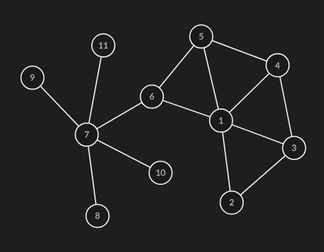

DFS

```bash
File: tests/test-own-undirected:
DFS Tree:
1
|- 6
   |- 7
      |- 11
      |- 10
      |- 9
      |- 8
   |- 5
      |- 4
         |- 3
            |- 2
Traversal: 1 6 7 11 10 9 8 5 4 3 2 
Time: 21484 ns (0 ms, 0 s)
```

BFS

```bash
File: tests/test-own-undirected:
1
|- 2
|- 3
|- 4
|- 5
|- 6
   |- 7
      |- 8
      |- 9
      |- 10
      |- 11
Traversal: 1 2 3 4 5 6 7 8 9 10 11 
Time: 23673 ns (0 ms, 0 s)
```

`test-own-separated` 

Graf skierowany, rozdzielony na dwa podgrafy o 5 wierzchołkach.

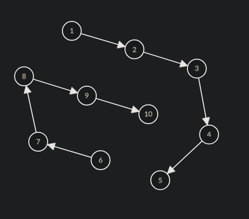

DFS

```bash
File: tests/test-own-separated:
DFS Tree:
1
|- 2
   |- 3
      |- 4
         |- 5
6
|- 7
   |- 8
      |- 9
         |- 10
Traversal: 1 2 3 4 5 6 7 8 9 10 
Time: 27704 ns (0 ms, 0 s)
```

BFS

```bash
File: tests/test-own-separated:
1
|- 2
   |- 3
      |- 4
         |- 5
Traversal: 1 2 3 4 5 
Time: 17825 ns (0 ms, 0 s)
```

`test-own-directed` 

Graf skierowany o 11 wierzchołkach

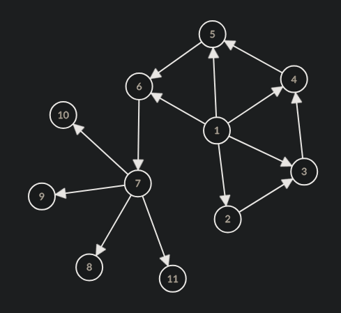

DFS

```bash
File: tests/test-own-directed:
DFS Tree:
1
|- 6
   |- 7
      |- 11
      |- 10
      |- 9
      |- 8
|- 5
|- 4
|- 3
|- 2
Traversal: 1 6 7 11 10 9 8 5 4 3 2 
Time: 33286 ns (0 ms, 0 s)
```

BFS

```bash
File: tests/test-own-directed:
1
|- 2
|- 3
|- 4
|- 5
|- 6
   |- 7
      |- 8
      |- 9
      |- 10
      |- 11
Traversal: 1 2 3 4 5 6 7 8 9 10 11 
Time: 29541 ns (0 ms, 0 s)
```

## Zadanie 2

`test-own-acyclic`

```
File: tests/test-own-acyclic.txt: graph is acyclic.
1 2 3 4 5 6 7 8 9 10 
Time: 12801 ns (0 ms, 0 s)
```

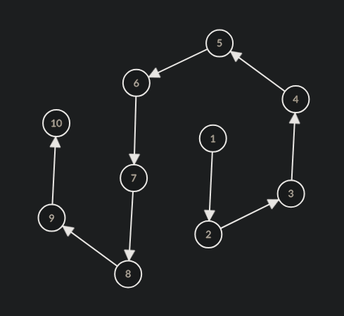

`test-own-cyclic`

```
File: tests/test-own-cyclic.txt: path: 1 2 3 4 5 6 7 8 9 10 and now 1.
cycle has been found
Time: 42212 ns (0 ms, 0 s)
```

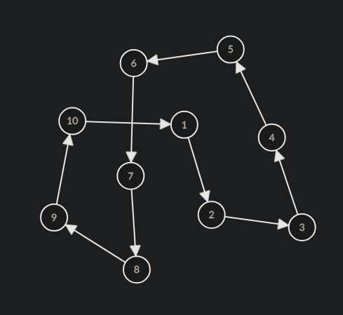

## Zadanie 3


`test-own-scc`

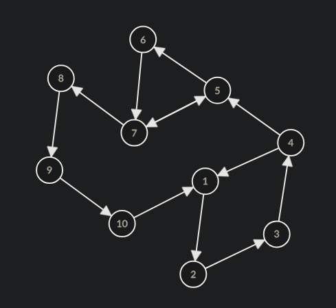

```
File: tests/test-own-scc.txt:
SCC Count: 1
- SCC of size 10
{ 1 10 9 8 7 6 5 4 3 2 }
Time: 9406 ns (0 ms, 0 s)
```

`test-own-z`

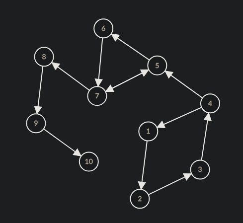

```
File: tests/test-own-z.txt:
SCC Count: 5
- SCC of size 4
{ 1 4 3 2 }
- SCC of size 3
{ 5 7 6 }
- SCC of size 1
{ 8 }
- SCC of size 1
{ 9 }
- SCC of size 1
{ 10 }
Time: 22973 ns (0 ms, 0 s)
```

## Zadanie 4

`test-own-bipartite-directed`

```
File: tests/test-own-bipartite-directed.txt:Graph is bipartite
Red: { 1 3 5 7 9 }
Black: { 2 4 6 8 10 }
Time: 13384 ns (0 ms, 0 s)
```

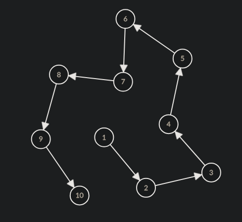

`test-own-bipartite-undirected`

```
File: tests/test-own-bipartite-undirected.txt:Graph is bipartite
Red: { 1 3 5 7 8 9 }
Black: { 2 4 6 10 }
Time: 7706 ns (0 ms, 0 s)
```

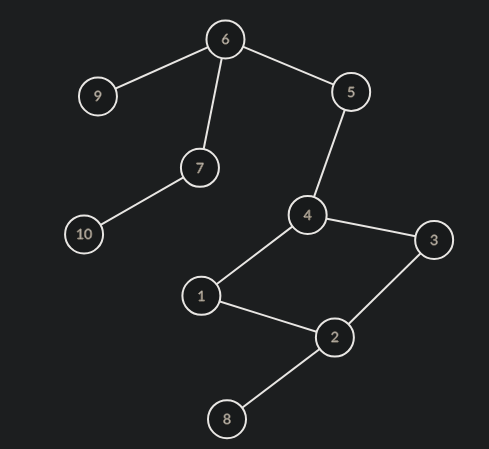

`test-own-unbipartite-directed`

```
File: tests/test-own-unbipartite-directed.txt:Graph is not bipartite
Time: 4621 ns (0 ms, 0 s)
```

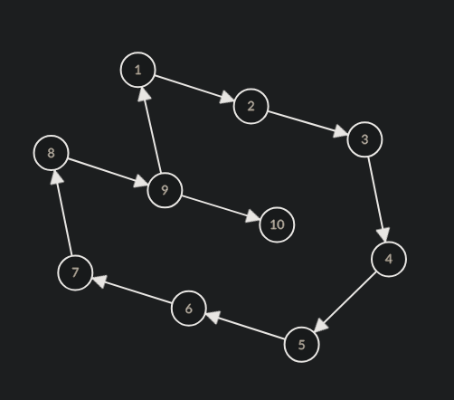

`test-own-unbipartite-undirected`

```
File: tests/test-own-unbipartite-undirected.txt:Graph is not bipartite
Time: 4259 ns (0 ms, 0 s)
```

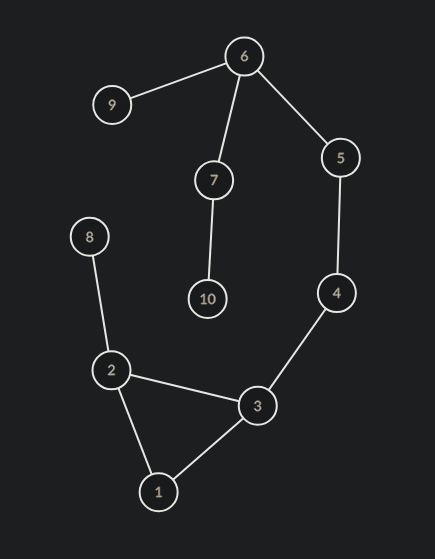
